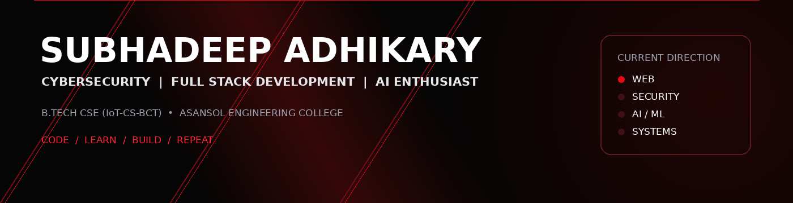

<div align="center">



<br>

### `CODE / LEARN / BUILD / REPEAT`

<p>
  <a href="https://subhadeep1357.github.io/my-portfolio/"></a>
  <a href="https://www.linkedin.com/in/subhadeepadhikary/"></a>
  <a href="https://github.com/SuBhAdEeP1357"></a>
  <a href="mailto:subhadeep1357@gmail.com"></a>
</p>


</div>

---

<table>
<tr>
<td width="58%" valign="top">

## `01` HELLO, I'M SUBHADEEP

I'm a **B.Tech Computer Science & Engineering (IoT-CS-BCT)** student at **Asansol Engineering College**, building toward a career in software engineering.

I enjoy turning ideas into practical projects across **web development, programming, networking, cybersecurity, databases, and AI**.

> **Turning ideas into impact.**

### Currently exploring

`Software Development` `Cybersecurity` `Network Security` `AI` `Full-Stack` `DSA`

</td>
<td width="42%" valign="top">

## `02` QUICK SNAPSHOT

🎓 **B.Tech CSE (IoT-CS-BCT)**  
🏫 **Asansol Engineering College**  
💻 **Software Development**  
🔐 **Cybersecurity & Networking**  
🤖 **AI Enthusiast**  
🌐 **Full-Stack Development**  
🧠 **DSA & Problem Solving**  
📍 **West Bengal, India**

</td>
</tr>
</table>

---

## `03` SKILLS

### 💻 Programming

| 🐍 Python | ☕ Java | ⚙️ C | ⚡ JavaScript |
|---|---|---|---|

### 🌐 Web Development

| 🌐 HTML | 🎨 CSS | 🖥️ Front-End Development | 📱 Responsive Web Design | 🔗 Full-Stack Development |
|---|---|---|---|---|

### 🗄️ Data & Computer Science

| 🗃️ SQL | 🗄️ DBMS | 🧠 DSA | 💡 Problem Solving |
|---|---|---|---|

### 🌐 Networking & Tools

| 🌐 Computer Networking | 🔀 Git | 🐙 GitHub | 🧩 Visual Studio Code | 🎵 FL Studio |
|---|---|---|---|---|

<details>
<summary><strong>18 skills • full list</strong></summary>

1. 🌐 HTML
2. 🎨 Cascading Style Sheets (CSS)
3. 🗄️ Database Management System (DBMS)
4. 🌐 Computer Networking
5. 🔀 Git
6. 🐙 GitHub
7. 🖥️ Front-End Development
8. 📱 Responsive Web Design
9. 🧩 Microsoft Visual Studio Code
10. 🎵 FL Studio
11. 🐍 Python
12. 🧠 Data Structures & Algorithms (DSA)
13. 💡 Problem Solving
14. ☕ Java
15. ⚙️ C
16. 🔗 Full-Stack Development
17. ⚡ JavaScript
18. 🗃️ SQL

</details>

---

## `04` FEATURED PROJECTS

> **REAL PROJECTS • REAL LEARNING • REAL PROGRESS**

<table>
<tr>
<td width="50%" valign="top">

### 🛡️ 01 — Network Intrusion Detection System

**Python · Suricata · EVE JSON**

A Suricata-based NIDS exploring traffic monitoring, custom detection rules, EVE JSON analysis, and automated testing.

`Cybersecurity` `Networking` `Security`

<br>

<a href="https://github.com/SuBhAdEeP1357/CodeAlpha_NetworkIntrusionDetectionSystem">

</a>

</td>
<td width="50%" valign="top">

### 🌐 02 — Basic Network Sniffer

**Python · Packet Analysis · Networking**

Educational network sniffer covering live packet capture, protocol analysis, filtering, packet details, and PCAP inspection.

`Python` `Networking` `Packet Analysis`

<br>

<a href="https://github.com/SuBhAdEeP1357/CodeAlpha_BasicNetworkSniffer">

</a>

</td>
</tr>
<tr>
<td width="50%" valign="top">

### 🔐 03 — Secure Coding Review

**Python · Bandit · Secure Development**

A secure-code review project focused on static analysis, vulnerability detection, remediation, and regression testing.

`Python` `Bandit` `Secure Coding`

<br>

<a href="https://github.com/SuBhAdEeP1357/CodeAlpha_SecureCodingReview">

</a>

</td>
<td width="50%" valign="top">

### 🧮 04 — Arithmetic Calculator

**C · Functions · Modular Programming**

A menu-driven calculator built in C to strengthen fundamentals in functions, control flow, arithmetic operations, and modular programming.

`C` `Console` `Programming`

<br>

<a href="https://github.com/SuBhAdEeP1357/Arithmetic-Calculator">

</a>

</td>
</tr>
</table>

---

## `05` ENGINEERING DIRECTION

<table>
<tr>
<td width="33%" valign="top">

### 💻 BUILD

Practical software, web applications, and full-stack foundations.

</td>
<td width="33%" valign="top">

### 🔐 SECURE

Network security, intrusion detection, and secure coding.

</td>
<td width="33%" valign="top">

### 🤖 EXPLORE

AI concepts, developer tools, and emerging technologies.

</td>
</tr>
</table>

```text
LEARN → BUILD → BREAK → DEBUG → IMPROVE → SHIP → REPEAT
```

> **Small projects. Better skills. Bigger possibilities.**

---

## `06` EDUCATION

### 🎓 B.Tech in Computer Science & Engineering (IoT-CS-BCT)
**Asansol Engineering College** • `2022–2026`

### 📚 Higher Secondary (Class XII)
**Science Stream** • `2020–2022`

### 📖 Secondary (Class X)
**West Bengal Board of Secondary Education** • `2010–2020`

---

## `07` CERTIFICATIONS

| 🏅 Certification | 🏢 Issuer | 📅 Date |
|---|---|---|
| 🤖 **Gen AI Tools** | FutureSkills Prime / Nasscom IT-ITeS SSC | `Aug 2026` |
| 🛡️ **Cybersecurity Analyst Job Simulation** | Tata / Forage | `Jul 2025` |
| 🔐 **Foundations of Cybersecurity** | Google / Coursera | `Jan 2024` |

---

## `08` GITHUB ACTIVITY

<div align="center">

### Contribution snapshot

**Building consistently. Learning continuously. Improving with every repository.**

<a href="https://github.com/SuBhAdEeP1357?tab=overview">
  
</a>

</div>

---

## `09` CURRENT FOCUS

| Area | Direction |
|---|---|
| 💻 Software Development | Practical applications + engineering fundamentals |
| 🌐 Full-Stack Development | Modern front-end + back-end development |
| 🔐 Cybersecurity | Network security + NIDS + secure coding |
| 🤖 Artificial Intelligence | AI concepts + practical experimentation |
| 🧠 DSA | Algorithms + data structures + problem solving |
| 🌍 Open Source | Public projects + collaboration + contribution |

---

## `10` CONNECT

<div align="center">

<a href="https://subhadeep1357.github.io/my-portfolio/"></a>
<a href="https://www.linkedin.com/in/subhadeepadhikary/"></a>
<a href="https://github.com/SuBhAdEeP1357"></a>
<a href="mailto:subhadeep1357@gmail.com"></a>

<br><br>

**`CODE / LEARN / BUILD / REPEAT`**

</div>
